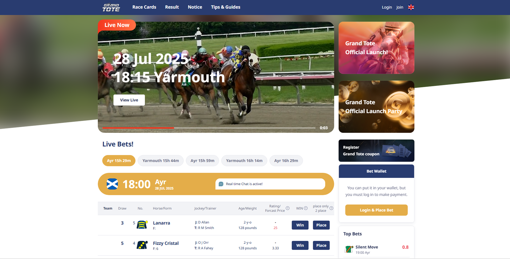

# GrandTote Horse Racing Bet Platform
Vue 3 기반 다국어 실시간 경마 베팅 웹 앱 입니다.




## 목차 (Table of Contents)
- [프로젝트 개요](#프로젝트-개요-overview)
- [아키텍처](#아키텍처-architecture)
- [주요 기능](#주요-기능-features)
- [기술적 하이라이트](#기술적-하이라이트)
- [기술 스택](#기술-스택-tech-stack)
- [프로젝트 구조](#프로젝트-구조)
- [API & 문서화](#api--문서화)
- [UI/UX 협업](#uiux-협업)


## 프로젝트 개요 (Overview)
- 목표: 글로벌 사용자에게 직관적이고 신뢰성 높은 실시간 베팅 경험 제공  
- 대상 사용자: 카자흐스탄·러시아·영미권 경마 베터


## 아키텍처 (Architecture)
```
[Vue 3 SPA]
    │ axios/http-client
    ▼
[Java Spring REST API] ←─ Nginx ─→ [Static CDN]
    │
    ├─ JWT 인증 (Access/Refresh)
    ├─ 쿠폰·KYC·베팅·히스토리 로직
    └─ Ably Pub/Sub (실시간 채팅·배당률)
    │
   Database & Cache
```


## 주요 기능 (Features)
- 실시간·녹화 경주 영상 플레이어
- 다국어(i18n) 지원 (KZ·RU·EN)
- Ably 채팅, Swiper Carousel
- 쿠폰·KYC 인증, 배팅·입출금·히스토리, 이벤트 포인트
- 보안 로그인 (Access/Refresh Token)
- 관리자 사이트 (쿠폰·회원·환불·채팅 관리)


## 기술적 하이라이트 (Technical Highlights)
- **API 호출 최적화**  
  - Bet History: 중복 호출 제거 및 캐싱 도입으로 응답 시간 12s → 4s 단축  
  - Calendar: 월별 데이터 한번만 로드하도록 로직 개선 (같은 월 내 재호출 방지)  
- **인증·보안**  
  - JWT Access/Refresh Token 자동 갱신 및 만료 처리  
  - 만료 시 무감지 로그아웃, HTTP‑Only 쿠키 스토리지 준비 완료  
- **실시간 기능**  
  - Ably 채팅 → Top‑Bets 실시간 갱신  
  - Live race rate, Tote UK 베팅 로직 분리·통합 토글  
- **Mobile Bottom‑Sheet Modals**  
  Deposit, Withdrawal, Profile 등 주요 모달을 vue‑bottom‑sheet로 구현해  
  · 드래그 투 클로즈/오픈  
  · 동적 높이 자동 조정  
  · 웹/모바일 모두 일관된 UX 제공
- **Form Validation & Error Handling**  
  · 최소/최대 충전액, KYC 입력값, 주소·이메일·비밀번호 유효성 검사  
  · 필드 단위 실시간 검증 메시지  
  · API 오류(1507, 1505 등) 대응용 커스텀 얼럿  


## 기술 스택 (Tech Stack)
- Frontend: Vue 3 Composition API, `<style scoped>` CSS, i18n(translation.json)
- 채팅: Ably
- UI 컴포넌트: Swiper Carousel, Custom Video Player
- 인증·보안: JWT Access/Refresh Token
- 배포: CDN, Nginx

## 프로젝트 구조
```
├─ public/ # 정적 자산
│ └─ cdn/ # CDN 호스팅 파일
└─ src/ # 소스 코드
├─ ably/ # Ably 실시간 모듈
├─ api/ # 도메인별 REST API 호출 래퍼
├─ components/ # 재사용 컴포넌트
├─ constants/ # 전역 상수
├─ font/ # 폰트 파일
├─ locale/ # i18n 번역 리소스
├─ router/ # Vue Router 설정
├─ service/ # 공통 서비스 로직
│ └─ api-service.js # axios.create()로 baseURL 세팅
├─ store/ # 전역 상태 관리 (Pinia/Vuex)
├─ util/ # 유틸리티 함수
└─ views/ # 각 페이지 컴포넌트
```


## API & 문서화 (API & Documentation)
- **Swagger**: 백엔드에서 auto‑generated된 Swagger UI로 모든 REST API를 직관적으로 탐색·호출  
- **Postman**: Postman Collection 제공, 개발·테스트·CI 파이프라인에 바로 연동 가능  


## UI/UX 협업
- **Figma 프로토타입**  
  디자이너와 실시간 피드백 → 모바일/데스크톱 화면 일관성 보장  
- **Responsive Design**  
  · Swiper Carousel·Custom Video Player  
  · 모든 모달·팝업 `backdrop-filter: blur()`  
  · 하단 시트 및 GNB 드로워 적용


## Upcoming Enhancements
이 리포지토리에서는 다음 기능을 개인 프로젝트로 새롭게 구현하여 코드와 데모를 공개할 예정입니다.

- Swiper Carousel 배너  
- Custom Video Player UI  
- Mobile Bottom‑Sheet Modal  
- Form Validation & Error Handling  
- 다국어(i18n) 스위처  
- 간단한 배팅 히스토리 페이지  
- 캘린더 컴포넌트 등